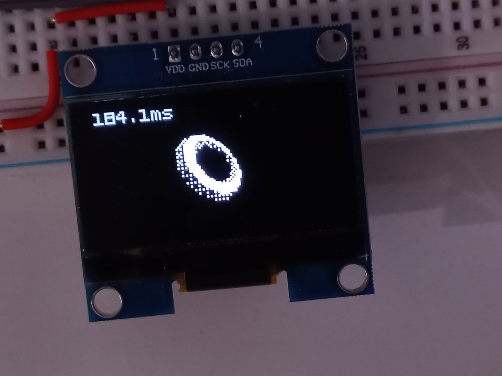
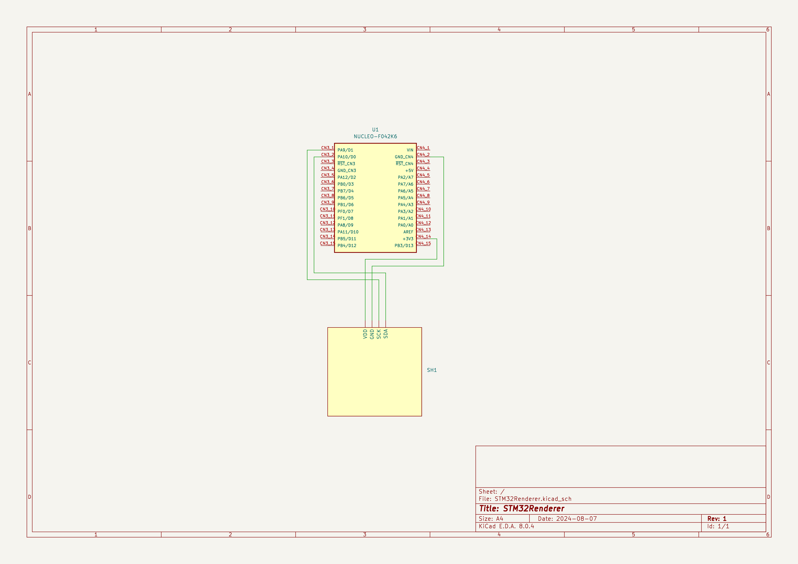

# STM32Renderer
Simple 3D rendering on the STM32F042 MCU (6 KiB SRAM, 32 KiB flash) to the SH1106 I<sup>2</sup>C 128x64 monochrome display using fixed point math and STM32 LL library.



Amount of used SRAM does not depend on complexity of the rendered shape, so complex enough meshes can be rendered (up to 512 triangles).

Contents:
* [Putting other meshes](#putting-other-meshes)
* [Building and uploading](#building-and-uploading)
* [Electronic schematic](#electronic-schematic)

## Putting other meshes 
Mesh data (vertices and normals) are stored in a separate header file `include/mesh_data.h`. The `scripts/extract_vertices_from_obj.py` script will generate the header file's new contents from a triangulated Wavefront OBJ file exported, for example, from Blender. So, to load a new mesh the next steps must be taken:
1. Prepare the .obj file (exporting from Blender, do not forget to tick the `Geometry > Triangulated Mesh` box). Also make sure that the mesh does not contain too many triangles (should be less than 513 to be safe).
2. Run the script passing the .obj file path as the `--input` argument. For example:
```
$ python scripts/extract_vertices_from_obj.py --input "/home/user/Desktop/model.obj"
```
3. Remove old contents of the `include/mesh_data.h` file and paste the script output here.
4. (Re)build and (re)upload.

## Building and uploading
Make sure that the Arm GNU Toolchain is installed.
```
$ git clone --recurse-submodules https://github.com/GRAPHENE9932/STM32Renderer.git
$ cd STM32Renderer
$ mkdir build
$ cd build
$ cmake -DCMAKE_BUILD_TYPE=Release -G Ninja ..
$ ninja
$ ninja upload
```

## Electronic schematic

